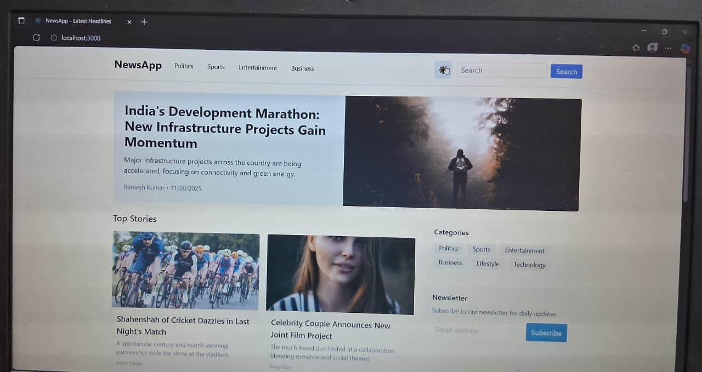

```markdown
**NewsAPP**

Next.js 14 + TailwindCSS + TypeScript demo project that replicates a front-page news portal.

Features:
- Responsive homepage with navbar, featured headline, categories, news cards and footer.
- Article detail pages with author, date, content and related news.
- Mock data located in /data/news.json.
- Uses Next.js App Router equivalents of static generation (generateStaticParams / server fetch).
- Image optimization via next/image.
- TailwindCSS styling.
- Dark mode toggle (client-side).
- SEO metadata and JSON-LD structured data.

Run:
1. npm install
2. npm run dev
3. Open http://localhost:3000

Notes:
- In the Next.js App Router (app/), static generation is done using `generateStaticParams` (equivalent to getStaticPaths).
  and server static fetch (equivalent to getStaticProps). The code explains this in comments.
```
---

##  Part B – Design Explanation + Documentation

### 1. Wireframe / Layout Overview 

The homepage follows a typical news portal layout:
- **Top navbar** with categories (Home, Politics, Sports, Entertainment, Business), Search bar, and Dark Mode toggle.
- **Featured news / hero section** highlighting the top story with a large image and bold headline.
- **Top stories** next to the featured news.
- **More news grid** displaying clickable news cards.
- **Category sidebar** with quick-access category filters.
- **Footer** with basic site info.

### 2. Layout Decisions
- Used a **two-column layout** for wide screens to mimic real news portals.
- On mobile, layout collapses to **single column** to improve readability.
- Featured stories use **larger images + bigger font** to attract attention.
- Category pages reuse the same card layout but filtered by category.

### 3. Data Fetching Strategy
Used **Static Generation** via:
- `generateStaticParams` → equivalent of `getStaticPaths`
- Server-side static fetch → equivalent of `getStaticProps`

**Why Static Generation?**
- Faster performance.
- SEO-friendly.
- Ideal when mock JSON doesn’t change often.
- Fits assignment requirement of static generation.

### 4. Components Created
- **Navbar** — navigation, search, dark mode toggle.
- **FeaturedNews** — hero section.
- **NewsCard** — reusable card component for all news lists.
- **CategorySection** — sidebar category UI.
- **Footer** — bottom information area.
- **Category Page** (`/category/[cat]`).
- **Search Page** (`/search`).
- **Article Page** (`/news/[slug]`).

### 5. Data Model
Each article object contains:
- `id`, `title`, `image`, `slug`, `category`, `summary`, `content`, `author`, `date`.
Structured similar to real news APIs to support filtering and routing.

### 6. Challenges & How I Solved Them
- **Category routing not working** → implemented dynamic category routes.
- **Fallback images & edge cases** → added defaults to avoid broken UI.

### 7. Improvements If Given More Time
- Add real News API integration.
- Add authentication + bookmark system.


---

##  Part C – Testing / Edge Cases

### ✔ Missing Article Image
- Shows a **fallback placeholder** if image is missing or broken.

### ✔ API / Data Returns Empty
- Displays: **“No news available.”**

### ✔ Long Titles Handling
- Uses `line-clamp` and `truncate` to prevent layout breaking.

### ✔ Search With No Results
- Displays a friendly message: **“No result found.”**

### ✔ Data Fetch Failure
- Wrapped fetch in try–catch.
- Shows fallback UI: **“Unable to load news.”**

### ✔ Loading States
- Added `loading.tsx` for article pages.
- Shows skeleton-like loader while page builds.

---
## Part D – AI Use + Reflection

### 1. What I Used AI For
- Generating initial boilerplate for components.
- Understanding `generateStaticParams`.

### 2. Where AI Was Wrong / Suboptimal
- Provided incorrect App Router paths (pages/ instead of app/).
- Missing imports / incomplete code in places.
- SEO metadata examples without metadataBase.
- Incorrect category filter casing.

### 3. How I Verified / Corrected AI Code
- Ran the app after every modification.
- Checked routing using logs.
- Cross-checked with Next.js documentation.
- Manually fixed broken logic, styling, and imports.
- Ensured all features matched assignment requirements.

### 4. What I Built Myself Beyond AI
- Complete category routing system.
- Fully working search page.
- Article page SEO + JSON-LD.
- Static generation logic for slugs.
- Custom fallback handling for missing data.
- Dark mode persistence + clean UI polish.

---